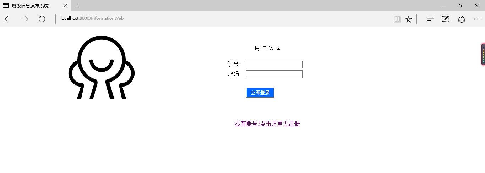

# 应用构建
## 一、classInformationWeb 主要界面功能介绍
1. 登陆界面&注册界面
      
      登陆界面为该web应用的第一个界面，用户可选择账号登录，或选择注册。
2. 主界面
      
      主界面为登陆成功之后进入的页面，为该web应用最为重要的一个界面。会包含查找用户，查看通知，发表消息等导航链接。
3. 查找用户界面
4. 查看通知界面
5. 发表评论界面
6. 发表消息界面

该web应用数据存储部分都存在了mysql数据库中，数据库相关操作通过预编译sql语句，有效的防止了sql注入。
### 二、登陆界面&注册界面
    登陆界面通过Loginservlet动态的获取用户提交的信息，即用户名和密码，交由服务端的数据库相关部分做匹配，做出相应的提示。
    
    注册界面由该页面的一个链接转到注册界面，同样通过Registservlet动态获取信息，进行判断后，交由服务端向数据库中添加消息，在注册界面中，为提高应用的安全性，加入了验证码操作。
  
#### 1. 实现界面如下：

#### 2. 实现代码如下：
### 三、主界面
    主页面为该web应用最关键的一个界面，应界面大方简洁，易使用。主页面中由frameset框架组成，top.jsp分别包含不同的导航链接指向相应功能的界面，xidian.jsp插入一张西电的图片，footer.jsp说明了一些版权信息。
    
#### 1. 实现界面如下：
   
#### 2. 实现代码如下：
   
### 四、查找用户界面
    查找用户界面主要分为通过姓名查找和通过学号查找，利用SearchUserservlet动态获取输入信息，交由服务端进行相应的数据库操作，返回信息跳转到用户信息界面。
  
#### 1. 实现界面如下：
   
   
#### 2. 实现代码如下：

### 五、查看通知界面
    查看通知界面以列表的形式显示消息的摘要，通过点击消息摘要可进入详细的消息介绍，在详细的消息介绍界面中，还可以进行评论，即发表评论界面。    
  
#### 1. 实现界面如下：
   
   
#### 2. 实现代码如下：
### 六、发表评论界面
    发表评论界面通过相应的servlet动态的获取信息，向数据库相应表中添加信息。在该页面有个回顶部列表，在评论过多时，点击可回到顶部。
  
#### 1. 实现界面如下：
   
   
#### 2. 实现代码如下：
### 七、发表消息界面
    发表消息界面，通过servlet动态的获取当前发表时间，发表人学号，发表内容，在服务端进行消息摘要的提取后，存储到数据库中。
  
#### 1. 实现界面如下：
   
   
#### 2. 实现代码如下：
